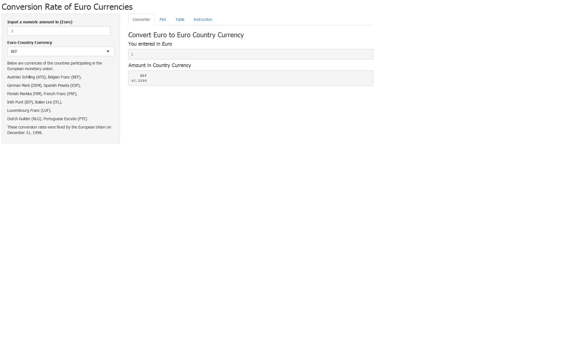

Euro Converter
========================================================
author: Foo HP 
date:   18 Jan 2016

Overview
========================================================

The objective of this simple shiny app is to :

- Convert Euro to the various currencies of the participating 
countries in the European monetary union

- Plot a Conversion Rate chart. (These conversion rates were fixed by the European Union on December 31, 1998)

- Display a Conversion Rate Table (note: display round to 2 digits)

- Provide Instruction on using this Shiny App. 

Data 
========================================================

The data for this project is obtained from :


     the euro data in the R datasets package
  
The source code can be found at : 

<https://github.com/FooHP/DDP>

View Data
========================================================


```r
data(euro)
Euro <- data.frame(EuroCountryCurrency=names(euro), ConvRate=euro, row.names=NULL)
Euro
```

```
   EuroCountryCurrency    ConvRate
1                  ATS   13.760300
2                  BEF   40.339900
3                  DEM    1.955830
4                  ESP  166.386000
5                  FIM    5.945730
6                  FRF    6.559570
7                  IEP    0.787564
8                  ITL 1936.270000
9                  LUF   40.339900
10                 NLG    2.203710
11                 PTE  200.482000
```


Application
========================================================
 
To access this shiny app :

<https://foohp.shinyapps.io/EuroConverter/>





